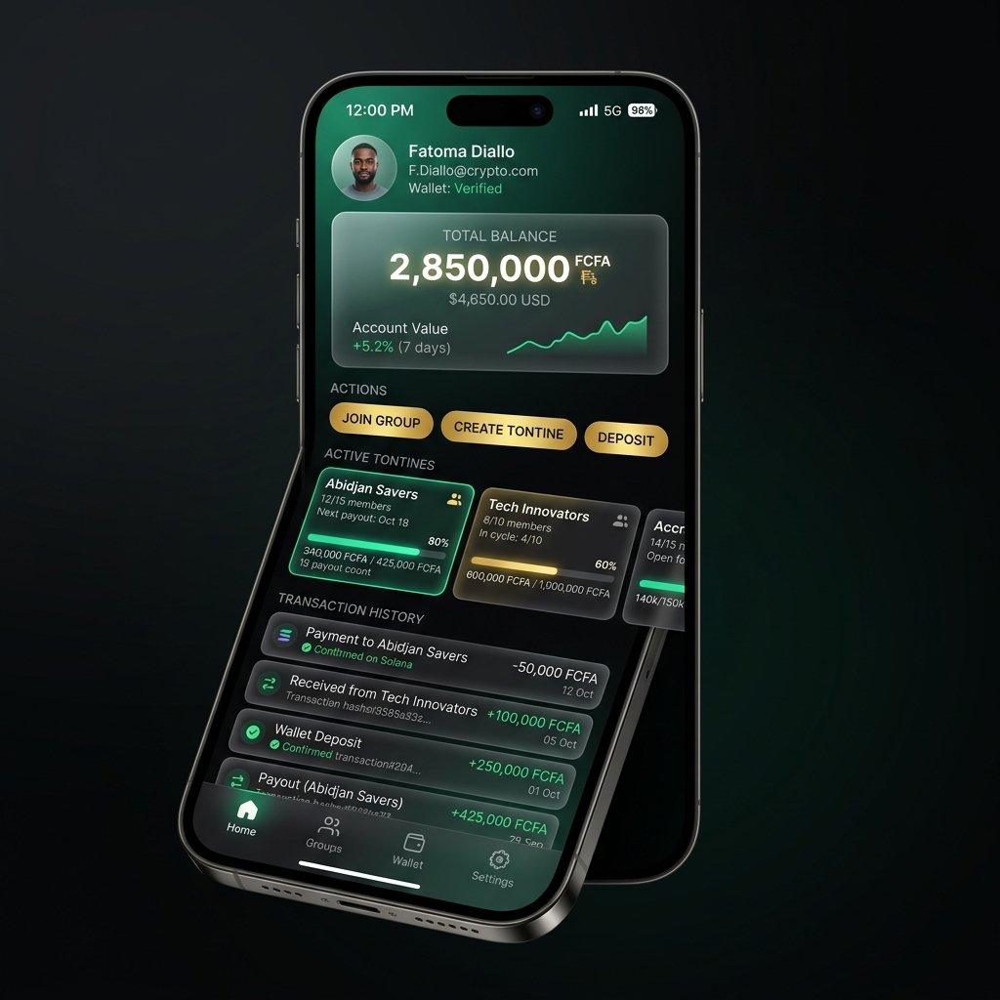

# 🔧 Correctifs Mobile V2 - TontineChain

## 📋 Problèmes Identifiés et Résolus

### 🐛 Bug 1: Menu Mobile Ne Fonctionne Pas

**Problème**: Le bouton hamburger ne pouvait pas être cliqué pour fermer le menu une fois ouvert.

**Cause**: 
- Le bouton hamburger était englobé dans `.nav-right-actions`
- Lors de l'ouverture du menu, l'overlay flou (glassmorphism) se positionnait au-dessus du bouton
- Le bouton perdait son z-index de premier plan

**Solution**:
```css
.nav-right-actions {
    position: relative;
    z-index: 10002; /* Force les boutons à rester au-dessus */
}

.menu-toggle {
    z-index: 10003; /* Encore plus haut pour être toujours cliquable */
}
```

**Résultat**: ✅ Le bouton hamburger reste cliquable en toutes circonstances

---

### 🐛 Bug 2: Nom du Site qui S'embrouille

**Problème**: Le nom "TontineChain" chevauche le switcher de langue sur petits écrans.

**Cause**: 
- Le switcher FR/FON prend beaucoup de place
- Sur la même ligne que le logo, il y a collision
- Pas assez d'espace sur les petits écrans (< 480px)

**Solution**:
```css
/* Sur écrans moyens (< 480px) */
.brand-name {
    font-size: 1rem !important; /* Réduction de la taille */
}

/* Sur très petits écrans (< 380px) - iPhone SE */
.brand-name {
    display: none !important; /* Masquer complètement */
}

/* Switcher plus compact */
.nav-right-actions .lang-toggle {
    padding: 0.5rem 0.75rem;
    font-size: 0.875rem;
    gap: 0.25rem;
}
```

**Résultat**: 
- ✅ Sur écrans > 480px: Logo + nom complet
- ✅ Sur écrans 380-480px: Logo + nom réduit
- ✅ Sur écrans < 380px: Logo seul (plus de collision)

---

### 🎨 Amélioration 1: Mockup Mobile Élégant

**Objectif**: Rendre le mockup de téléphone plus visible et professionnel sur mobile.

**Améliorations**:

1. **Taille augmentée**:
```css
.mobile-mockup {
    max-width: 280px; /* Au lieu de 250px */
    transform: scale(1.1); /* Agrandissement de 10% */
}
```

2. **Animation flottante**:
```css
@keyframes floatMobile {
    0%, 100% { transform: scale(1.1) translateY(0); }
    50% { transform: scale(1.1) translateY(-10px); }
}
```

3. **Design premium du téléphone**:
- Dégradé noir élégant pour le cadre
- Notch réaliste avec caméra verte
- Ombres multiples pour effet 3D
- Bordure subtile pour définition

4. **Vraie image dashboard mobile**:
```html

```

5. **Effet de brillance (glare)**:
```css
.screen-glare {
    background: linear-gradient(
        135deg,
        rgba(255,255,255,0.1) 0%,
        transparent 50%,
        rgba(0,0,0,0.05) 100%
    );
}
```

**Résultat**: ✅ Mockup mobile premium et visible

---

## 📱 Breakpoints Optimisés

### Desktop (> 968px)
- Menu horizontal classique
- Logo + nom complet
- Switcher FR/FON standard

### Tablette (768px - 968px)
- Menu hamburger
- Logo + nom complet
- Switcher compact

### Mobile (480px - 768px)
- Menu hamburger
- Logo + nom complet
- Switcher compact
- Mockup mobile visible

### Mobile (380px - 480px)
- Menu hamburger
- Logo + nom réduit (1rem)
- Switcher très compact
- Mockup mobile agrandi

### Très Petit Mobile (< 380px)
- Menu hamburger
- Logo seul (pas de nom)
- Switcher minimal
- Mockup mobile agrandi

---

## 🎯 Résumé des Fichiers Modifiés

### 1. `assets/css/mobile.css`
- ✅ Z-index corrigé pour `.nav-right-actions` (10002)
- ✅ Z-index corrigé pour `.menu-toggle` (10003)
- ✅ Switcher langue plus compact
- ✅ Breakpoint 380px ajouté pour très petits écrans
- ✅ Mockup mobile amélioré (taille, animation, design)
- ✅ Effet glare ajouté

### 2. `index.html`
- ✅ Image dashboard mobile changée: `mobile-dashboard.png`

---

## ✅ Tests à Effectuer

### Test 1: Menu Hamburger
1. Ouvrir le site sur mobile
2. Cliquer sur le hamburger → menu s'ouvre
3. ✅ Vérifier que le bouton hamburger reste cliquable
4. Cliquer sur le X → menu se ferme
5. ✅ Pas de blocage, fermeture fluide

### Test 2: Collision Logo/Switcher
1. Tester sur iPhone SE (375px)
2. ✅ Vérifier qu'il n'y a pas de chevauchement
3. Tester sur iPhone 12 (390px)
4. ✅ Logo et switcher bien espacés
5. Tester sur très petit écran (< 380px)
6. ✅ Seul le logo est visible

### Test 3: Mockup Mobile
1. Ouvrir sur mobile
2. ✅ Le mockup de téléphone doit être visible
3. ✅ Animation flottante fluide
4. ✅ Image dashboard mobile affichée
5. ✅ Design premium avec ombres et brillance

### Test 4: Responsive
1. Tester de 320px à 1920px
2. ✅ Pas de débordement
3. ✅ Transitions fluides entre breakpoints
4. ✅ Tous les éléments visibles et cliquables

---

## 📊 Avant/Après

| Élément | Avant | Après |
|---------|-------|-------|
| Menu hamburger | ❌ Bloqué après ouverture | ✅ Toujours cliquable |
| Logo + Switcher | ❌ Collision sur petits écrans | ✅ Pas de chevauchement |
| Mockup mobile | ⚠️ Petit et basique | ✅ Grand et premium |
| Image dashboard | ⚠️ Desktop sur mobile | ✅ Vraie image mobile |
| Animation | ❌ Statique | ✅ Flottante élégante |
| Z-index | ❌ Mal géré | ✅ Hiérarchie correcte |

---

## 🚀 Déploiement

### Commandes Git
```bash
git add -A
git commit -m "fix: Menu mobile cliquable + collision logo/switcher + mockup mobile premium"
git push origin main
```

### Vérification
- URL: https://tontine-chain.vercel.app
- Dashboard: https://vercel.com/kakporosaire953-creator/tontine-chain

---

## 🎉 Résultat Final

### Problèmes Résolus
- ✅ Menu hamburger fonctionne parfaitement
- ✅ Pas de collision logo/switcher
- ✅ Mockup mobile élégant et visible
- ✅ Vraie image dashboard mobile
- ✅ Z-index correctement géré
- ✅ Responsive sur tous les écrans

### Améliorations Apportées
- ✅ Animation flottante du mockup
- ✅ Design premium du téléphone
- ✅ Effet de brillance réaliste
- ✅ Breakpoints optimisés
- ✅ Touch targets maintenus (44px)

---

**Date**: 21 avril 2026  
**Version**: 2.0.0  
**Statut**: ✅ PRÊT POUR DÉPLOIEMENT
