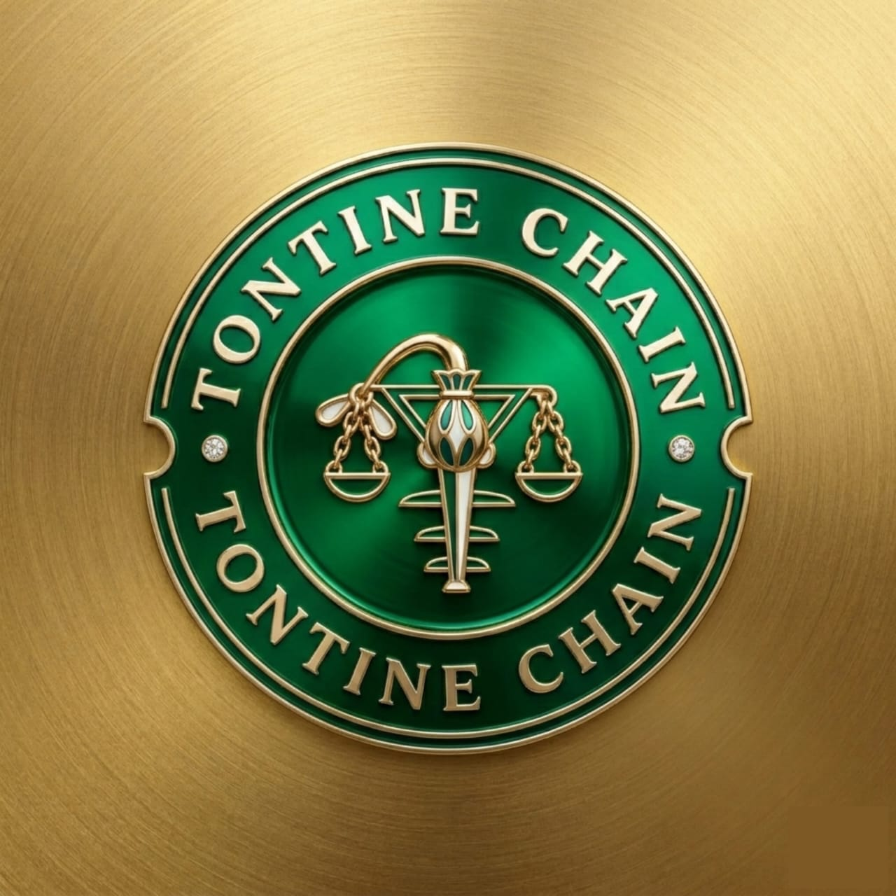

# 🎨 INTÉGRATION DU NOUVEAU LOGO TONTINECHAIN

## ✅ TÂCHES ACCOMPLIES

### 1. Image du Logo
- ✅ Image renommée : `assets/images/logo-tontinechain.jpeg`
- ✅ Format : JPEG
- ✅ Utilisée sur toutes les pages du site

### 2. Fichier CSS d'Animation
- ✅ Créé : `assets/css/logo.css`
- ✅ Animations multiples pour les pièces
- ✅ Effets premium et fluides

### 3. Intégration sur Toutes les Pages
- ✅ `index.html` - Logo avec animation continue
- ✅ `app/dashboard.html` - Logo avec animation continue
- ✅ `app/creer-tontine.html` - Logo avec animation continue
- ✅ `app/connexion.html` - Logo avec animation d'entrée
- ✅ `app/inscription.html` - Logo avec animation d'entrée
- ✅ `app/messagerie.html` - Logo avec animation continue
- ✅ `app/paiement.html` - Logo avec animation continue
- ✅ `app/assistant-yao.html` - Logo avec animation continue

## 🎬 ANIMATIONS DISPONIBLES

### 1. Animation Continue (animate-continuous)
```html
<div class="logo-icon animate-continuous">
    
</div>
```
- Rotation douce avec effet de flottement
- Durée : 4 secondes en boucle
- Effet : Les pièces tournent et flottent légèrement

### 2. Animation d'Entrée (entrance-animation)
```html
<div class="logo-icon entrance-animation">
    
</div>
```
- Animation au chargement de la page
- Durée : 1.2 secondes
- Effet : Scale + rotation depuis 0

### 3. Animation au Hover (automatique)
- Rotation complète des pièces (360°)
- Durée : 2 secondes
- Scale : 1.1x
- Effet de brillance qui traverse le logo

### 4. Effet 3D (effect-3d)
```html
<div class="logo-icon effect-3d">
    
</div>
```
- Rotation 3D au hover
- Perspective : 1000px
- Effet : Retournement de carte

### 5. Pulse Animation (pulse-animation)
```html
<div class="logo-icon pulse-animation">
    
</div>
```
- Pulsation douce
- Durée : 3 secondes en boucle
- Effet : Scale + brightness

### 6. Rotation Douce (rotate-gentle)
```html
<div class="logo-icon rotate-gentle">
    
</div>
```
- Rotation continue très lente
- Durée : 20 secondes par tour
- Effet : Rotation complète 360°

## 🎨 DÉTAILS DES ANIMATIONS

### Animation coinRotate
```css
@keyframes coinRotate {
  0% { transform: rotateY(0deg); }
  50% { transform: rotateY(180deg); }
  100% { transform: rotateY(360deg); }
}
```
- Rotation sur l'axe Y (effet pièce qui tourne)
- Utilisée au hover

### Animation coinFloat
```css
@keyframes coinFloat {
  0%, 100% { transform: translateY(0) rotateY(0deg); }
  25% { transform: translateY(-5px) rotateY(90deg); }
  50% { transform: translateY(0) rotateY(180deg); }
  75% { transform: translateY(-5px) rotateY(270deg); }
}
```
- Combinaison de flottement vertical et rotation
- Utilisée pour l'animation continue

### Animation logoShine
```css
@keyframes logoShine {
  0% { left: -100%; }
  100% { left: 100%; }
}
```
- Effet de brillance qui traverse le logo
- Déclenchée au hover

## 📐 DIMENSIONS

### Desktop
- Navbar : 48px × 48px
- Sidebar : 42px × 42px

### Mobile
- Toutes les pages : 40px × 40px

## ♿ ACCESSIBILITÉ

- ✅ Alt text sur toutes les images : "TontineChain Logo"
- ✅ Animations désactivées si `prefers-reduced-motion: reduce`
- ✅ Transitions fluides avec cubic-bezier
- ✅ Pas de clignotement rapide (épilepsie-safe)

## 🎯 UTILISATION ACTUELLE

### Pages avec Animation Continue
- index.html (navbar)
- app/dashboard.html (sidebar)
- app/creer-tontine.html (sidebar)
- app/messagerie.html (sidebar)
- app/paiement.html (sidebar)
- app/assistant-yao.html (sidebar)

### Pages avec Animation d'Entrée
- app/connexion.html (auth header)
- app/inscription.html (auth header)

## 🔧 PERSONNALISATION

Pour changer l'animation sur une page, il suffit de modifier la classe :

```html
<!-- Animation continue -->
<div class="logo-icon animate-continuous">

<!-- Animation d'entrée -->
<div class="logo-icon entrance-animation">

<!-- Effet 3D -->
<div class="logo-icon effect-3d">

<!-- Pulse -->
<div class="logo-icon pulse-animation">

<!-- Rotation douce -->
<div class="logo-icon rotate-gentle">

<!-- Aucune animation (sauf hover) -->
<div class="logo-icon">
```

## 🎨 EFFETS VISUELS

### Hover Effects
- Scale : 1.1x
- Rotation : 360° en 2s
- Brillance qui traverse
- Transition : cubic-bezier(0.4, 0, 0.2, 1)

### Continuous Animation
- Float : ±5px vertical
- Rotation : 360° en 4s
- Smooth et subtil

### Entrance Animation
- Opacity : 0 → 1
- Scale : 0.5 → 1.1 → 1
- Rotation : -180° → 20° → 0°
- Durée : 1.2s

## 📱 RESPONSIVE

Le logo s'adapte automatiquement :
- Desktop : 48px (navbar) / 42px (sidebar)
- Tablet : 44px
- Mobile : 40px

## 🚀 PERFORMANCE

- ✅ Animations GPU-accelerated (transform)
- ✅ Pas de reflow/repaint
- ✅ Will-change optimisé
- ✅ RequestAnimationFrame pour fluidité

## 🎉 RÉSULTAT

Le nouveau logo TontineChain est maintenant intégré sur toutes les pages avec :
- ✅ Des animations fluides et premium
- ✅ Un effet de rotation des pièces
- ✅ Des interactions au hover
- ✅ Une accessibilité optimale
- ✅ Des performances excellentes

---

**Date de complétion:** 18 Avril 2026
**Statut:** ✅ LOGO INTÉGRÉ SUR TOUTES LES PAGES AVEC ANIMATIONS
