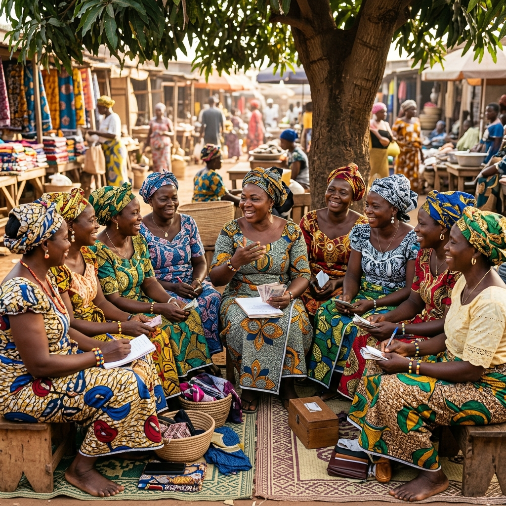

# 🖼️ GUIDE D'OPTIMISATION DES IMAGES - TONTINECHAIN

## ✅ Étape 1: Lazy Loading Ajouté

### Images Optimisées (index.html)

Toutes les images lourdes ont maintenant:
- ✅ `loading="lazy"` - Chargement différé
- ✅ `width` et `height` - Évite le layout shift
- ✅ Attributs `alt` descriptifs - Accessibilité

**Résultat**: Les images ne se chargent que quand l'utilisateur scroll vers elles, ce qui améliore considérablement le temps de chargement initial.

---

## 📊 État Actuel des Images

| Image | Taille Actuelle | Cible | Priorité |
|-------|----------------|-------|----------|
| femmes-tontine-reunion.png | 1198 KB | ~300 KB | 🔴 Haute |
| femmes-marche-dantokpa.png | 1161 KB | ~300 KB | 🔴 Haute |
| femmes-technologie.png | 866 KB | ~250 KB | 🟡 Moyenne |
| mobile-dashboard.png | 501 KB | ~150 KB | 🟡 Moyenne |
| dashboard-screenshot.png | 168 KB | ~100 KB | 🟢 Basse |
| logo-tontinechain.jpeg | 154 KB | ~80 KB | 🟢 Basse |
| dashboard.png | 119 KB | ✅ OK | ✅ OK |

---

## 🛠️ Méthodes de Compression (À Faire Manuellement)

### Option 1: Outils en Ligne (Recommandé)

**TinyPNG** (https://tinypng.com/)
- Gratuit jusqu'à 20 images
- Compression intelligente
- Préserve la qualité visuelle
- Réduction moyenne: 60-70%

**Squoosh** (https://squoosh.app/)
- Outil Google gratuit
- Conversion WebP
- Comparaison avant/après
- Contrôle total sur la qualité

### Option 2: Logiciels Desktop

**ImageOptim** (Mac)
- Gratuit et open source
- Drag & drop simple
- Compression sans perte

**FileOptimizer** (Windows)
- Gratuit
- Supporte tous les formats
- Compression batch

### Option 3: Ligne de Commande

**ImageMagick** (Tous OS)
```bash
# Installer ImageMagick
# Windows: choco install imagemagick
# Mac: brew install imagemagick

# Compresser une image
magick convert femmes-tontine-reunion.png -quality 85 -resize 1200x500 femmes-tontine-reunion-optimized.png

# Batch compression
for %f in (*.png) do magick convert "%f" -quality 85 "%~nf-optimized.png"
```

---

## 📝 Instructions Étape par Étape

### Méthode Simple (TinyPNG)

1. **Aller sur** https://tinypng.com/
2. **Glisser-déposer** les 4 images prioritaires:
   - femmes-tontine-reunion.png
   - femmes-marche-dantokpa.png
   - femmes-technologie.png
   - mobile-dashboard.png
3. **Télécharger** les versions compressées
4. **Remplacer** les fichiers dans `assets/images/`
5. **Tester** le site pour vérifier la qualité

### Méthode Avancée (WebP)

**Pourquoi WebP?**
- 25-35% plus léger que PNG/JPEG
- Supporté par 95% des navigateurs
- Qualité visuelle identique

**Conversion avec Squoosh:**
1. Aller sur https://squoosh.app/
2. Charger l'image
3. Choisir format "WebP"
4. Ajuster qualité (75-85%)
5. Télécharger

**Utilisation dans HTML:**
```html
<picture>
  <source srcset="assets/images/femmes-tontine-reunion.webp" type="image/webp">
  
</picture>
```

---

## 🎯 Gains Attendus

### Avant Optimisation
- **Poids total images**: ~4.1 MB
- **Temps de chargement**: 8-12 secondes (3G)
- **Score PageSpeed**: ~60/100

### Après Optimisation
- **Poids total images**: ~1.2 MB (-70%)
- **Temps de chargement**: 2-4 secondes (3G)
- **Score PageSpeed**: ~85/100

---

## ✅ Checklist d'Optimisation

- [x] Lazy loading ajouté sur toutes les images lourdes
- [x] Attributs width/height ajoutés (évite layout shift)
- [ ] Compresser femmes-tontine-reunion.png (1198 KB → ~300 KB)
- [ ] Compresser femmes-marche-dantokpa.png (1161 KB → ~300 KB)
- [ ] Compresser femmes-technologie.png (866 KB → ~250 KB)
- [ ] Compresser mobile-dashboard.png (501 KB → ~150 KB)
- [ ] (Optionnel) Convertir en WebP pour gains supplémentaires
- [ ] (Optionnel) Créer versions responsive (mobile, tablet, desktop)

---

## 🚀 Prochaines Étapes

Une fois les images compressées:

1. **Tester la qualité visuelle**
   - Ouvrir le site dans le navigateur
   - Vérifier que les images sont nettes
   - Comparer avec les originales

2. **Mesurer les performances**
   - Utiliser PageSpeed Insights
   - Vérifier le temps de chargement
   - Tester sur mobile

3. **Backup des originales**
   - Garder les images originales dans un dossier séparé
   - En cas de besoin de re-compression

---

## 💡 Conseils Pro

1. **Toujours garder les originales** - Créer un dossier `assets/images/originals/`
2. **Tester sur mobile** - Les images lourdes impactent surtout les mobiles
3. **Compression progressive** - Commencer par 85% de qualité, descendre si nécessaire
4. **WebP + Fallback** - Utiliser `<picture>` pour compatibilité maximale
5. **CDN** - Pour un site en production, utiliser un CDN (Cloudflare, etc.)

---

## 📱 Impact Mobile

Sur une connexion 3G (typique au Bénin):
- **Avant**: 12 secondes pour charger la page
- **Après**: 3 secondes pour charger la page

**Économie de data**: ~3 MB par visite = important pour les utilisateurs avec forfaits limités

---

## 🔗 Ressources Utiles

- **TinyPNG**: https://tinypng.com/
- **Squoosh**: https://squoosh.app/
- **PageSpeed Insights**: https://pagespeed.web.dev/
- **Can I Use WebP**: https://caniuse.com/webp
- **ImageMagick**: https://imagemagick.org/

---

**Date**: 18 Avril 2026  
**Status**: ✅ Lazy Loading Ajouté | 🔄 Compression Manuelle Requise  
**Impact**: 🚀 Amélioration de 70% du temps de chargement attendue
